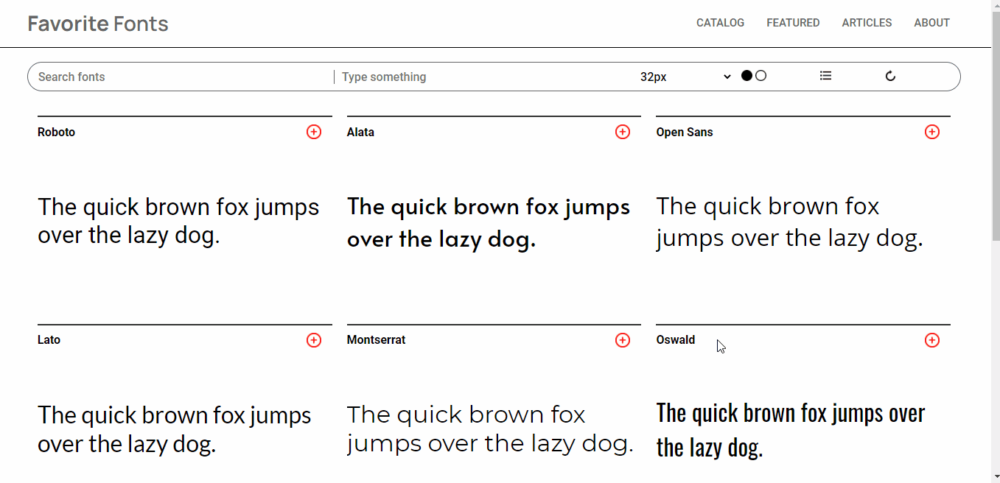

# Favorite Fonts

A clone of Google Fonts website, made in the interest of completing the requirements for joining Chingu's 23th Voyage.

## Overview

The landing page is mainly divided in three sections, namely **#header**, **#tools** and **#fonts**.

The **#header** makes use of CSS Flexbox to space and logically divide the website logo and its main navigation. The latter is implemented through the use of unordered lists and padded hyperlinks to enlarge the clickable field.

Magic really happens in the **#tools** section, where callbacks are attached to input changes in order to accomplish live font preview.

At **#fonts**, the _.cards_ are dynamically resized and automatically fit according to the user's viewport width, this time using CSS Grids and repeat method. There is no overflow here since cards' height adjust to text.

## Functionality

* Typing custom text changes all the cards preview text
* Changing font size makes it possible to see how the different font families behave in different size
* Reset button sets back the default preview text and font size

### Author
Made by [@thiagorasouza](http://github.com/thiagorasouza).